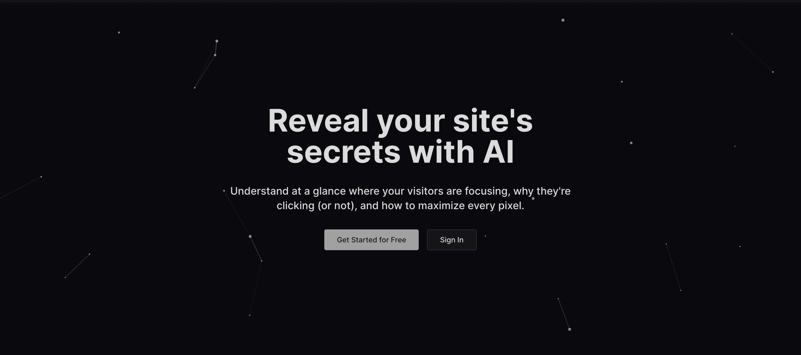

<!-- markdownlint-disable MD033 -->
<h1 align="center">Aittention</h1>

  

  

## L'équipe

- [Oomaxime](https://github.com/Oomaxime)
- [Alexis-Gontier](https://github.com/Alexis-Gontier)
- [Jeck0v](https://github.com/Jeck0v)
- [Kae134](https://github.com/Kae134)

## Tech Stack

### Frontend

- [Next.js](https://nextjs.org/)
- [TypeScript](https://www.typescriptlang.org/)
- [ShadCN](https://ui.shadcn.com/)
- [Up-Fetch](https://github.com/L-Blondy/up-fetch?tab=readme-ov-file)
- [Playwright](https://playwright.dev/)
- Plus de détails ici -> [Frontend README](./frontend/README.md)

### Backend

- [FastAPI](https://fastapi.tiangolo.com/)
- [MongoDB](https://www.mongodb.com/)
- Plus de détails ici -> [Backend README](./backend/README.md)

### Model IA

- [IA](https://github.com/Arhosseini77/SUM)

### Infrastructure

- [Azure](https://azure.microsoft.com/fr-fr/products/devops)
- [K8S-AKS](https://azure.microsoft.com/fr-fr/products/kubernetes-service)
- [K8S](https://kubernetes.io/)
- [Spacelift](https://spacelift.io/)
- [Terraform](https://developer.hashicorp.com/terraform)
